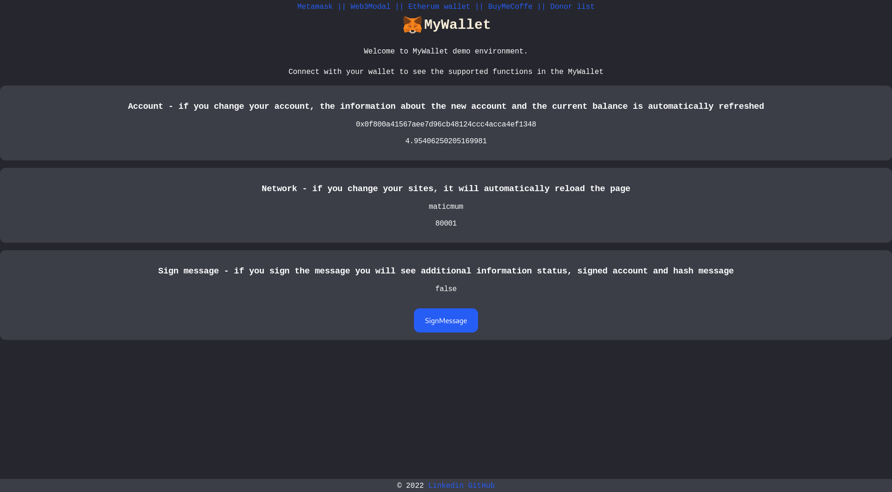

#  MyWallet

Integration of Svelte based App with Smart Contract and the way to work dynamically with a wallet.
[`DEMO`](http://mywallet.pgmsoft.com).
Frontend will be able to do the following:

* Metamask wallet login
* Web3Modal wallet login
* dynamic account management
* creation of new account
* sign message
* allow the user to send a greeting message along with money on black coffee
* display all the greeting messages on the front-end along with the sender's address


# ScreenShot



# create-svelte

Everything you need to build a Svelte project, powered by [`create-svelte`](https://github.com/sveltejs/kit/tree/master/packages/create-svelte).

## Creating a project

If you're seeing this, you've probably already done this step. Congrats!

```bash
# create a new project in the current directory
npm init svelte

# create a new project in my-app
npm init svelte my-app
```

## Developing

Once you've created a project and installed dependencies with `npm install` (or `pnpm install` or `yarn`), start a development server:

```bash
npm run dev

# or start the server and open the app in a new browser tab
npm run dev -- --open
```

## Building

To create a production version of your app:

```bash
npm run build
```

You can preview the production build with `npm run preview`.

> To deploy your app, you may need to install an [adapter](https://kit.svelte.dev/docs/adapters) for your target environment.
